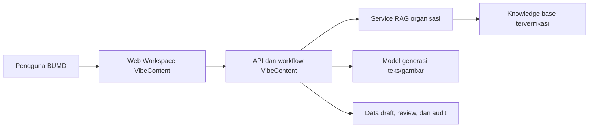

# Product Requirements Document (PRD)

## Document Info

| Field | Value |
|---|---|
| **Project Name** | VibeContent |
| **Version** | v0.1 |
| **Status** | Draft for team and BUMD stakeholder review |
| **Author** | Darren |
| **Team** | Darren and Maul |
| **Created** | 30/09/2026 |
| **Last Updated** | 30/09/2026 |
| **Target Launch** | TBD after pilot scope and stakeholder timeline are agreed |

---

## 1. Overview

### 1.1 Problem Statement

BUMD teams may need to prepare promotional and corporate content using information spread across documents, brand materials, and internal references. This can make content production slower and create extra review work when facts, terminology, or tone are inconsistent. These are initial problem hypotheses and must be confirmed with the selected BUMD team before implementation.

**Core Pain Points (to validate):**
- Staff spend time finding approved facts and rewriting similar content for different formats.
- Drafts may not consistently follow the organization’s terminology, brand voice, and communication standards.
- Reviewers need a clear way to check factual claims and approve content before it is used externally.

### 1.2 Proposed Solution

VibeContent is a professional content creation workspace for BUMD staff. It uses an organization’s approved knowledge base through RAG to help prepare copy, short-form scripts, and images, then supports editing, review, and export. RAG is the only source of BUMD-specific facts; if approved materials do not support a claim, the system must flag the gap rather than invent an answer.

### 1.3 Value Proposition

| Untuk | Yang | Kami menawarkan | Tidak seperti | Karena |
|---|---|---|---|---|
| Tim komunikasi, pemasaran, dan unit bisnis BUMD | Perlu membuat konten dengan cepat tanpa kehilangan akurasi dan standar korporat | VibeContent, workspace AI untuk membuat dan meninjau konten berbasis pengetahuan resmi organisasi | Proses manual yang tersebar atau asisten AI umum tanpa konteks internal yang dikelola | Konten faktual dikaitkan dengan sumber organisasi, gaya dapat mengikuti panduan merek, dan draft dapat melalui proses review |

### 1.4 Competitive Landscape

Analisis kompetitor belum dilakukan. Baris berikut adalah alternatif penggunaan yang perlu diverifikasi melalui riset pengguna dan stakeholder.

| Alternatif | Kelebihan | Keterbatasan yang perlu diuji | Potensi pembeda VibeContent |
|---|---|---|---|
| Penulisan manual dan dokumen bersama | Familiar dan fleksibel | Pencarian referensi, konsistensi, dan pelacakan versi dapat memerlukan banyak pekerjaan | Brief, sumber, draft, dan status review berada dalam satu alur |
| Asisten AI umum | Cepat menghasilkan teks | Belum tentu memiliki akses terkontrol ke sumber internal atau alur persetujuan BUMD | Menggunakan RAG dari materi yang disetujui dan menampilkan rujukan |
| Aplikasi desain atau copywriting | Memiliki fungsi produksi konten tertentu | Kesesuaian dengan sumber resmi dan tata kelola BUMD perlu dinilai | Menggabungkan konteks organisasi, pembuatan konten, dan review dalam satu workspace |

**Positioning Statement:**
> VibeContent adalah workspace pembuatan konten berbantuan AI untuk tim BUMD yang ingin menghasilkan draft profesional berdasarkan materi resmi organisasi, dengan rujukan sumber dan proses review yang jelas.

### 1.5 Monetization Model

**Model Bisnis:** Belum ditetapkan. Kemungkinan pilot atau pengadaan B2B perlu dibahas bersama sponsor dan calon BUMD pengguna. Tidak ada tier, harga, paywall, atau target pendapatan yang ditetapkan dalam draft ini.

### 1.6 Assumptions

| ID | Asumsi | Dampak jika Salah | Verifikasi By |
|---|---|---|---|
| A-01 | BUMD pilot bersedia menyediakan pengguna perwakilan untuk validasi kebutuhan dan uji coba | Use case dan prioritas MVP perlu disusun ulang | Diskusi dengan dosen penghubung dan sponsor BUMD |
| A-02 | Organisasi dapat menyediakan materi resmi yang boleh digunakan sebagai knowledge base | RAG tidak dapat menghasilkan konten yang cukup kontekstual | BUMD content owner dan tim teknis |
| A-03 | Pengguna mengakses aplikasi melalui internet | Perlu menilai kebutuhan akses jaringan terbatas/offline | Validasi lingkungan kerja pengguna |
| A-04 | Aplikasi menggunakan model generatif untuk menyusun teks dan gambar, sedangkan fakta BUMD berasal dari RAG | Jika model/provider tidak tersedia, ruang lingkup generasi perlu disesuaikan | Technical spike dan persetujuan BUMD |
| A-05 | Pengalaman web responsif dengan orientasi desktop cocok untuk pekerjaan korporat | Prioritas antarmuka dan platform harus diubah jika pengguna utama bekerja dari perangkat lain | Uji kebutuhan pengguna |
| A-06 | Draft eksternal perlu ditinjau manusia sebelum dipakai atau dipublikasikan | Proses approval dan peran harus disesuaikan jika kebijakan berbeda | Konfirmasi kebijakan komunikasi BUMD |
| A-07 | VibeContent perlu mengikuti arsitektur multi-organisasi pada platform bersama | Model workspace dan isolasi data dapat berubah jika aplikasi hanya untuk satu organisasi | Konfirmasi arsitektur induk dan sponsor |

---

## 2. Goals & Success Metrics

### 2.1 Goals (In Scope)

- [ ] Membantu staf membuat draft copywriting, naskah singkat, dan gambar berdasarkan brief serta materi organisasi yang disetujui.
- [ ] Menjaga jawaban faktual tetap terikat pada knowledge base organisasi, menampilkan rujukan, dan menyatakan dengan jelas ketika sumber tidak memadai.
- [ ] Menyediakan antarmuka dan bahasa yang profesional, konsisten, dan sesuai konteks kerja korporat.
- [ ] Mendukung pengeditan, review, persetujuan, penyimpanan, dan ekspor draft.
- [ ] Menjaga pemisahan akses serta knowledge base setiap organisasi jika platform digunakan oleh lebih dari satu BUMD.

### 2.2 Non-Goals (Out of Scope)

- VibeContent tidak melakukan pencarian fakta di internet atau memakai sumber publik eksternal untuk melengkapi klaim BUMD pada MVP.
- VibeContent tidak menerbitkan konten secara otomatis ke media sosial atau situs BUMD pada MVP.
- Analisis performa konten berdasarkan data engagement platform eksternal belum masuk MVP.
- VibeContent tidak menggantikan persetujuan resmi, verifikasi legal, atau tanggung jawab komunikasi perusahaan.
- Monetisasi, paket langganan, dan pembayaran belum ditentukan.
- Pemilihan vendor model, database, cloud, framework, dan strategi deployment belum diputuskan.

### 2.3 MVP Boundary

#### Yang MASUK MVP

| Feature | Alasan Masuk MVP |
|---|---|
| Akses pengguna dan peran dasar | Workspace korporat memerlukan akses yang terkontrol |
| Profil organisasi dan panduan merek dasar | Menjaga keluaran sesuai identitas, terminologi, dan arahan komunikasi BUMD |
| Knowledge base dan RAG | Ini adalah dasar konteks dan fakta VibeContent |
| Brief pembuatan konten | Mengarahkan tujuan, audiens, kanal, format, pesan, dan CTA |
| Pembuatan dan pengeditan copy serta naskah singkat | Memberikan nilai inti pada tugas creative-content agent |
| Pembuatan gambar atau visual | Termasuk dalam rencana awal; bergantung pada ketersediaan model/provider yang disetujui |
| Pemeriksaan sumber, gaya, dan kelengkapan | Mengurangi klaim tanpa dukungan serta membantu review profesional |
| Alur review dan approval dasar | Draft korporat perlu memiliki status dan pihak peninjau yang jelas |
| Library draft dan ekspor | Memungkinkan tim menyimpan serta menggunakan hasil di proses kerja yang sudah ada |
| Antarmuka profesional berbahasa Indonesia | Syarat dasar agar aplikasi dapat diuji dalam konteks BUMD |

#### Yang TIDAK masuk MVP

| Feature | Alasan Ditunda | Target Fase |
|---|---|---|
| Publikasi dan penjadwalan otomatis ke media sosial | Memerlukan integrasi, izin, dan proses operasional tambahan | Phase 2 atau setelah pilot |
| Analitik engagement dari platform eksternal | Memerlukan integrasi data dan keputusan kanal | Phase 2 |
| Pencarian tren internet atau berita eksternal | Tidak sesuai dengan batas sumber faktual RAG pada MVP | Ditinjau terpisah |
| Kampanye multi-kanal otomatis dan batch content calendar | MVP perlu memvalidasi alur pembuatan inti terlebih dahulu | Phase 2 |
| Versi mobile native | Belum ada kebutuhan yang tervalidasi; web responsif menjadi asumsi awal | Setelah validasi |
| Billing, subscription, dan paywall | Model bisnis belum ditentukan | Setelah keputusan komersial |

> Perubahan fitur setelah scope MVP disetujui perlu dicatat sebagai backlog dan ditukar dengan scope lain melalui keputusan Product Owner.

### 2.4 Product Metrics (Business KPI)

Target numerik ditetapkan setelah baseline dan kriteria pilot disepakati bersama pengguna BUMD.

| Metrik | Baseline | Target | Cara Ukur |
|---|---|---|---|
| Waktu dari brief ke draft yang dianggap layak oleh pengguna | Diukur saat observasi proses saat ini | Target ditetapkan setelah baseline | Bandingkan tugas sejenis sebelum dan saat pilot |
| Tingkat draft yang lolos review dengan revisi minimal | Belum tersedia | Target ditetapkan bersama reviewer | Catat status dan jumlah putaran revisi |
| Tingkat penggunaan rujukan pada klaim faktual | Belum tersedia | Semua klaim yang bersumber dari knowledge base menampilkan rujukan yang tersedia; ambang kualitas perlu diuji | Evaluasi sampel draft dan referensi RAG |
| Keberhasilan penyelesaian alur brief sampai ekspor/approval | Belum tersedia | Target ditetapkan setelah uji kegunaan | Event alur kerja dan observasi usability |
| Kepuasan/persepsi kegunaan pengguna pilot | Belum tersedia | Baseline dan target disepakati saat pilot | Survei singkat dan wawancara pengguna |

### 2.5 Technical Metrics (Engineering KPI)

| Metrik | Target | Cara Ukur |
|---|---|---|
| Waktu respons pembuatan teks dan gambar | TBD setelah provider dan ekspektasi pengguna diuji | Catat latency tiap tahap dan total waktu |
| Keberhasilan layanan RAG dan generation | TBD sebelum pilot | Monitor error, timeout, dan retry |
| Akurasi isolasi tenant/workspace | Tidak boleh ada akses silang | Uji otorisasi dan retrieval lintas workspace |
| Kualitas grounding | Kriteria evaluasi ditetapkan dengan dokumen dan pertanyaan uji BUMD | Review manual atas keterjawaban, relevansi sumber, dan unsupported claims |
| Ketersediaan layanan | TBD sesuai lingkungan hosting dan SLA yang disetujui | Monitoring uptime |
| Keberhasilan ekspor dan unggah sumber | TBD setelah uji teknis | Log hasil operasi dan pengujian integrasi |

---

## 3. User & Stakeholder

### 3.1 Target Users

Persona di bawah ini bersifat hipotesis dan perlu diverifikasi dengan calon pengguna BUMD.

#### Persona 1: Staf Pembuat Konten
```
Nama peran   : Content Creator / Staf komunikasi atau pemasaran
Pekerjaan    : Menyiapkan konten perusahaan untuk kanal yang ditentukan
Tech Savvy   : Perlu divalidasi
Goals        : Menghasilkan draft profesional dengan cepat dan memakai informasi resmi
Frustrations : Mencari referensi, menjaga konsistensi gaya, dan mengelola revisi
Device       : Web desktop sebagai asumsi awal; responsif untuk layar lebih kecil
Context      : Menyusun draft kampanye, promosi, informasi layanan, atau naskah singkat
```

#### Persona 2: Reviewer / Approver
```
Nama peran   : Atasan, editor, atau petugas komunikasi yang berwenang
Pekerjaan    : Memeriksa kesesuaian fakta, bahasa, brand, dan kebijakan komunikasi
Tech Savvy   : Perlu divalidasi
Goals        : Melihat sumber, memberi catatan, meminta revisi, dan menyetujui draft
Frustrations : Tidak mengetahui sumber klaim atau perubahan yang telah dilakukan
Device       : Web desktop sebagai asumsi awal
Context      : Review sebelum konten digunakan di luar organisasi
```

#### Persona 3: Admin Workspace / Knowledge Owner
```
Nama peran   : Admin workspace atau pemilik materi resmi
Pekerjaan    : Mengelola pengguna, profil merek, dan dokumen knowledge base
Tech Savvy   : Perlu divalidasi
Goals        : Memastikan hanya sumber resmi dan mutakhir yang tersedia bagi pengguna
Frustrations : Dokumen usang, akses yang tidak tepat, atau sumber tanpa pemilik yang jelas
Device       : Web desktop sebagai asumsi awal
Context      : Menyiapkan dan memelihara workspace organisasi
```

### 3.2 Stakeholders

| Role | Nama/Tim | Kepentingan |
|---|---|---|
| Product Owner / pemilik kebutuhan | Belum ditetapkan; calon sponsor BUMD | Menentukan masalah, prioritas, dan kriteria penerimaan |
| Penghubung awal | Dosen penghubung Darren | Membantu membuka komunikasi dengan direktori BUMD; peran formal perlu dikonfirmasi |
| Tim produk dan pengembang | Darren dan Maul | Analisis, rancangan, implementasi, dan demo sesuai pembagian kerja tim |
| Pengguna konten | Perwakilan unit BUMD | Memvalidasi alur kerja, format, bahasa, dan kegunaan |
| Reviewer/approver | Perwakilan BUMD yang berwenang | Menentukan review dan persetujuan konten |
| Knowledge owner / admin | Perwakilan BUMD yang ditunjuk | Menyetujui, memperbarui, dan mengelola sumber knowledge |
| Tim teknis RAG/platform | Belum ditetapkan | Menyediakan API, kontrol tenant, dan integrasi teknis |

### 3.3 RACI Matrix

Pembagian akuntabilitas personal belum ditetapkan. RACI final perlu disepakati setelah Product Owner dan perwakilan BUMD ditentukan.

| Aktivitas | Product Owner BUMD | Tim Darren & Maul | Content User | Knowledge Owner |
|---|:---:|:---:|:---:|:---:|
| Validasi masalah dan kebutuhan | A | R | C | C |
| Prioritas MVP | A | R/C | C | C |
| Persetujuan panduan merek dan konten sumber | C | I | C | A/R |
| Desain dan implementasi produk | C | A/R | C | C |
| Pengujian kegunaan | A | R | R/C | C |
| Persetujuan pilot | A | R/C | C | C |

---

## 4. Features & Requirements

### 4.1 Feature Priority (MoSCoW)

| Priority | Label | Arti |
|---|---|---|
| P0 | Must Have | Wajib untuk MVP agar alur pembuatan dan review inti dapat diuji |
| P1 | Should Have | Penting untuk pilot korporat; dapat diprioritaskan setelah scope dan kapasitas disepakati |
| P2 | Could Have | Peningkatan setelah alur inti tervalidasi |
| P3 | Won't Have | Tidak dikerjakan pada scope saat ini |

### 4.2 Feature List

| ID | Feature | Priority | Tier | Status | PIC | Notes |
|---|---|---|---|---|---|---|
| F-01 | Workspace, login, dan kontrol peran | P0 | N/A | Draft | Tim Darren & Maul | Metode autentikasi dan integrasi SSO TBD |
| F-02 | Profil organisasi dan panduan merek | P0 | N/A | Draft | Tim Darren & Maul | Termasuk terminologi, gaya, dan aset resmi |
| F-03 | Knowledge base dan manajemen sumber | P0 | N/A | Draft | Tim platform/BUMD TBD | Sumber harus berstatus jelas dan terikat pada organisasi |
| F-04 | Retrieval RAG, rujukan, dan fallback tanpa sumber | P0 | N/A | Draft | Tim platform/RAG TBD | Tidak memakai pencarian web untuk fakta organisasi |
| F-05 | Brief konten | P0 | N/A | Draft | Tim Darren & Maul | Kanal dan format awal perlu divalidasi |
| F-06 | Pembuatan copywriting dan naskah singkat | P0 | N/A | Draft | Tim Darren & Maul | Mengacu brief dan sumber yang ditemukan |
| F-07 | Pembuatan gambar/visual | P0 | N/A | Draft | Tim teknis TBD | Provider/model dan aturan aset resmi TBD |
| F-08 | Editor, variasi, dan riwayat versi | P0 | N/A | Draft | Tim Darren & Maul | Simpan revisi sebagai draft terpisah/versi |
| F-09 | Pemeriksaan gaya, brief, dan dukungan fakta | P0 | N/A | Draft | Tim Darren & Maul | Analisis performa media sosial bukan bagian fitur ini |
| F-10 | Review, komentar, dan approval dasar | P0 | N/A | Draft | Tim Darren & Maul | Tahapan final perlu dikonfirmasi kepada BUMD |
| F-11 | Library, pencarian, dan ekspor | P0 | N/A | Draft | Tim Darren & Maul | Format ekspor TBD setelah kebutuhan kanal diketahui |
| F-12 | Audit aktivitas dan kontrol sumber | P1 | N/A | Draft | Tim platform/TBD | Simpan metadata yang diperlukan tanpa mencatat rahasia |
| F-13 | Penjadwalan/publikasi otomatis | P3 | N/A | Out of scope | - | Tidak masuk MVP |
| F-14 | Analitik performa berdasarkan engagement | P3 | N/A | Out of scope | - | Menunggu integrasi dan keputusan kanal |

### 4.3 Functional Requirements

#### F-01: Workspace, Login, dan Kontrol Peran
**Deskripsi:** Pengguna yang berwenang masuk ke workspace organisasi dan hanya dapat melakukan tindakan sesuai perannya.

**Requirements:**
- [ ] Pengguna harus terautentikasi sebelum membuka workspace dan konten internal.
- [ ] Sistem mengenali organisasi/workspace pengguna dari sesi tepercaya; klien tidak dapat mengganti konteks tenant untuk mengakses data organisasi lain.
- [ ] MVP mendukung sekurangnya peran Creator, Reviewer/Approver, dan Workspace Admin/Knowledge Owner.
- [ ] Hak membuat, mengedit, meninjau, menyetujui, mengelola sumber, dan mengelola pengguna dibatasi berdasarkan peran.
- [ ] Metode login, kebijakan sesi, SSO, dan proses provisioning akun mengikuti keputusan BUMD dan arsitektur platform.

**Acceptance Criteria:**
```gherkin
Scenario: Pengguna hanya melihat workspace yang diizinkan
  GIVEN pengguna telah masuk dan memiliki akses ke Workspace A
  WHEN pengguna membuka library atau knowledge search
  THEN sistem hanya mengembalikan data yang dimiliki atau dibagikan kepada Workspace A
  AND permintaan untuk mengakses Workspace B ditolak dan dicatat sebagai peristiwa keamanan
```

#### F-02 dan F-03: Profil Organisasi, Panduan Merek, dan Knowledge Base
**Deskripsi:** Admin yang berwenang menyiapkan aturan merek serta materi resmi yang digunakan oleh VibeContent.

**Requirements:**
- [ ] Profil organisasi dapat menyimpan nama, unit, bahasa default, terminologi, tone of voice, larangan istilah, CTA umum, dan kanal/format yang disetujui.
- [ ] Admin dapat menambahkan atau memperbarui dokumen yang didukung oleh keputusan teknis; format file dan batas ukuran masih TBD.
- [ ] Setiap sumber memiliki metadata minimum: organisasi, judul, jenis, pemilik/penanggung jawab jika tersedia, tanggal berlaku atau versi jika tersedia, status, dan waktu unggah.
- [ ] Hanya materi yang berstatus disetujui/aktif yang dapat dipakai untuk generasi.
- [ ] Admin dapat menonaktifkan atau mengganti sumber usang; draft lama tetap menyimpan catatan sumber yang digunakan saat dibuat.
- [ ] Pengguna dapat mengetahui apakah sumber aktif, usang, gagal diproses, atau menunggu persetujuan.

**Acceptance Criteria:**
```gherkin
Scenario: Sumber yang belum disetujui tidak menjadi konteks generasi
  GIVEN dokumen telah diunggah tetapi statusnya menunggu persetujuan
  WHEN Creator meminta draft baru
  THEN dokumen tersebut tidak digunakan sebagai fakta sumber
  AND status dokumen terlihat oleh Knowledge Owner
```

#### F-04: RAG, Rujukan Sumber, dan Fallback
**Deskripsi:** VibeContent mencari konteks dalam sumber resmi organisasi dan menggunakan hasil retrieval untuk mendukung klaim faktual.

**Requirements:**
- [ ] Retrieval hanya mencari di knowledge base yang sesuai dengan organisasi dan izin pengguna.
- [ ] Tidak ada web search atau akses sumber eksternal untuk mengisi fakta BUMD pada MVP.
- [ ] Hasil yang memuat klaim faktual menampilkan rujukan yang dapat dibuka/diperiksa, seperti judul sumber dan bagian relevan jika API menyediakannya.
- [ ] Sistem membedakan konten kreatif yang bersifat usulan dari klaim tentang fakta organisasi.
- [ ] Jika tidak ada sumber yang memadai, sistem menyatakan keterbatasan dan meminta pengguna menambahkan atau mengonfirmasi informasi melalui prosedur yang benar.
- [ ] Jika retrieval atau generation gagal, sistem menampilkan status gagal dengan bahasa profesional dan menyediakan tindakan ulang yang aman.

**Acceptance Criteria:**
```gherkin
Scenario: Knowledge base tidak memiliki jawaban
  GIVEN pengguna meminta klaim tentang layanan BUMD
  AND knowledge base aktif tidak berisi informasi yang mendukung klaim tersebut
  WHEN VibeContent menyusun draft
  THEN sistem tidak menyajikan klaim itu sebagai fakta
  AND sistem memberi tanda bahwa informasi belum tersedia di sumber resmi
  AND draft tetap dapat disimpan dengan status perlu verifikasi jika pengguna memilih melanjutkan
```

#### F-05: Brief Konten
**Deskripsi:** Creator menjelaskan tujuan sebelum meminta materi dibuat.

**Requirements:**
- [ ] Brief meminta tujuan, audiens, format/kanal, pesan utama, tone konten, CTA, dan bahasa.
- [ ] Brief dapat memilih produk/layanan/kampanye jika item tersebut tersedia di knowledge base atau profil organisasi.
- [ ] Field yang tidak relevan dapat dilewati; field minimum ditentukan setelah format awal dipilih.
- [ ] Sistem menampilkan rangkuman brief sebelum generasi dan memperbolehkan pengguna memperbaikinya.

#### F-06 dan F-07: Pembuatan Copy, Naskah, dan Gambar
**Deskripsi:** Sistem membuat output yang sesuai brief dan panduan organisasi.

**Requirements:**
- [ ] Format awal yang direncanakan: copy/caption, teks promosi, dan naskah video singkat; daftar format final dikonfirmasi dengan BUMD.
- [ ] Output diberi label Draft dan tidak ditampilkan sebagai konten yang telah disetujui.
- [ ] Copy dan naskah menggunakan Bahasa Indonesia baku secara default, kecuali pengguna memilih bahasa lain yang didukung.
- [ ] Pengguna dapat memilih tujuan dan tone konten tanpa mengubah batasan fakta dan panduan organisasi.
- [ ] Pengguna dapat meminta pembuatan gambar/visual berdasarkan brief dan panduan merek, dengan provider/model yang disetujui.
- [ ] Aset/logo resmi harus memakai file yang disediakan organisasi; sistem tidak boleh mengklaim gambar generatif sebagai logo resmi.
- [ ] Provider generation, biaya, batas pemakaian, hak penggunaan aset, dan kebijakan penyimpanan hasil perlu disepakati sebelum pilot.

**Acceptance Criteria:**
```gherkin
Scenario: Draft menggunakan fakta yang bersumber
  GIVEN brief dan sumber aktif memuat informasi layanan yang relevan
  WHEN Creator meminta caption promosi
  THEN draft mematuhi brief dan panduan bahasa organisasi
  AND klaim faktual yang didukung menampilkan rujukan sumber
  AND hasil ditandai sebagai Draft
```

#### F-08: Editor, Variasi, dan Riwayat Versi
**Requirements:**
- [ ] Creator dapat mengedit teks hasil generasi secara langsung.
- [ ] Creator dapat meminta perubahan terarah, misalnya lebih ringkas, lebih formal, lebih persuasif, atau disesuaikan untuk kanal lain.
- [ ] Sistem menyimpan versi sebelumnya dan mengaitkan versi dengan brief serta rujukan yang digunakan.
- [ ] Perubahan oleh Creator tidak mengubah sumber resmi atau profil merek.
- [ ] Sistem tidak menandai konten sebagai approved hanya karena konten diedit atau diekspor.

#### F-09: Pemeriksaan Gaya, Brief, dan Dukungan Fakta
**Requirements:**
- [ ] Sistem memeriksa apakah output mengikuti tone, format, pesan utama, dan CTA yang dipilih.
- [ ] Sistem menandai klaim yang tidak memiliki rujukan atau terlihat tidak cocok dengan materi sumber.
- [ ] Sistem dapat memberi saran perbaikan, tetapi tidak boleh menyebut draft “terverifikasi” jika pemeriksaan otomatis saja yang dilakukan.
- [ ] Analisis pada MVP berfokus pada draft dan brief; analisis engagement atau tren kanal eksternal tidak termasuk.

#### F-10: Review, Komentar, dan Approval
**Requirements:**
- [ ] Creator dapat mengirim draft untuk review.
- [ ] Reviewer dapat menyetujui, meminta revisi dengan komentar, atau menolak dengan alasan.
- [ ] Status minimum: Draft, Menunggu Review, Revisi Diminta, Disetujui, dan Diarsipkan.
- [ ] Reviewer dapat melihat brief, draft, versi sebelumnya, dan rujukan sumber.
- [ ] Pengguna hanya dapat menyetujui jika memiliki peran yang diizinkan.
- [ ] Approval tidak otomatis menerbitkan konten ke kanal eksternal.

**Acceptance Criteria:**
```gherkin
Scenario: Reviewer meminta revisi
  GIVEN draft berstatus Menunggu Review
  AND pengguna memiliki peran Reviewer
  WHEN Reviewer meminta revisi dan menambahkan komentar
  THEN status draft menjadi Revisi Diminta
  AND Creator dapat melihat komentar serta mengirim versi baru
  AND riwayat keputusan tetap tersedia
```

#### F-11: Library dan Ekspor
**Requirements:**
- [ ] Pengguna berwenang dapat menyimpan, membuka, mencari, memfilter, dan mengarsipkan draft sesuai workspace.
- [ ] Filter minimum mencakup status, format, tanggal, pembuat, dan kampanye jika fitur kampanye disetujui.
- [ ] Ekspor mempertahankan isi, status, dan rujukan yang relevan; format ekspor ditetapkan setelah kebutuhan BUMD diketahui.
- [ ] Gambar hasil generasi dapat diunduh jika penggunaan provider dan hak penggunaan aset telah disetujui.
- [ ] Konten yang diekspor tetap menampilkan status approval di aplikasi; ekspor tidak mengubah status.

#### F-12: Audit Aktivitas dan Kontrol Sumber
**Requirements:**
- [ ] Catat metadata aktivitas penting: unggah/perubahan sumber, perubahan peran, pengiriman review, keputusan approval, dan ekspor.
- [ ] Audit record memuat aktor, workspace, waktu, objek, dan tindakan; hindari menyimpan token, password, atau salinan penuh dokumen di log operasional.
- [ ] Masa simpan dan akses audit log ditetapkan bersama BUMD.

### 4.4 Non-Functional Requirements

| Kategori | Requirement | Target | Priority |
|---|---|---|---|
| **Usability** | Alur utama jelas bagi staf korporat dan tidak mengharuskan pengguna menulis prompt teknis | Diuji dengan perwakilan Creator dan Reviewer | P0 |
| **Interface** | Tampilan profesional, konsisten, responsif, dan mendukung penggunaan desktop | Desktop-first sebagai asumsi; breakpoint dan design system TBD | P0 |
| **Language** | Label, validasi, pesan error, dan respons VibeContent profesional dan baku | Bahasa Indonesia default; bahasa tambahan TBD | P0 |
| **Grounding** | Klaim faktual BUMD didasarkan pada retrieval sumber organisasi | Tidak ada fakta organisasi tanpa sumber atau tanda perlu verifikasi | P0 |
| **Security** | Otorisasi diterapkan pada dokumen, draft, aset, dan hasil retrieval | Uji pemisahan tenant dan hak peran sebelum pilot | P0 |
| **Privacy** | Konten dan dokumen BUMD tidak digunakan untuk melatih model di luar kesepakatan eksplisit | Kebijakan provider dan organisasi perlu diverifikasi sebelum pilot | P0 |
| **Auditability** | Sumber dan keputusan review dapat dilacak | Retensi dan detail audit TBD bersama BUMD | P0 |
| **Accessibility** | Teks mudah dibaca, kontras dan fokus keyboard memadai | Mengacu pada standar aksesibilitas yang disepakati saat desain | P1 |
| **Performance** | Generasi dan retrieval memberi status proses/error yang jelas | Ambang waktu ditetapkan setelah uji provider dan pengguna | P0 |
| **Availability** | Gangguan layanan tidak menyebabkan draft hilang tanpa pemberitahuan | Target uptime/SLA TBD | P1 |
| **Compatibility** | Mendukung browser korporat yang disepakati dan layout responsif | Daftar browser/perangkat TBD saat pilot | P0 |

---

## 5. User Stories

### Epic 1: Membuat Konten Berbasis Pengetahuan Organisasi

| ID | User Story | Priority | Story Points |
|---|---|---|---|
| US-01 | Sebagai Creator, saya ingin mengisi brief konten agar draft sesuai tujuan dan audiens | P0 | TBD |
| US-02 | Sebagai Creator, saya ingin membuat copy atau naskah dari sumber resmi agar tidak perlu mencari dan merangkai semua informasi secara manual | P0 | TBD |
| US-03 | Sebagai Creator, saya ingin melihat rujukan untuk klaim faktual agar dapat memeriksa asal informasinya | P0 | TBD |
| US-04 | Sebagai Creator, saya ingin diberi tahu jika sumber resmi tidak memuat informasi yang saya minta agar saya tidak menyebarkan klaim yang tidak terverifikasi | P0 | TBD |
| US-05 | Sebagai Creator, saya ingin membuat atau meminta visual yang mengikuti brief dan aset merek resmi | P0 | TBD |
| US-06 | Sebagai Creator, saya ingin mengedit dan meminta variasi draft agar hasilnya cocok untuk kebutuhan kanal | P0 | TBD |

### Epic 2: Meninjau dan Mengelola Konten secara Profesional

| ID | User Story | Priority | Story Points |
|---|---|---|---|
| US-07 | Sebagai Reviewer, saya ingin melihat brief, sumber, dan riwayat draft agar dapat meninjau konten secara kontekstual | P0 | TBD |
| US-08 | Sebagai Reviewer, saya ingin menyetujui atau meminta revisi dengan komentar agar keputusan dapat ditindaklanjuti | P0 | TBD |
| US-09 | Sebagai Creator, saya ingin menyimpan dan mencari draft agar pekerjaan tidak hilang dan dapat digunakan kembali | P0 | TBD |
| US-10 | Sebagai Admin, saya ingin mengelola sumber dan panduan merek agar generasi menggunakan materi yang masih berlaku | P0 | TBD |
| US-11 | Sebagai Admin, saya ingin setiap data terisolasi per organisasi agar dokumen dan draft tidak terlihat oleh tenant lain | P0 | TBD |

---

## 6. Technical Architecture

> Bagian ini mendefinisikan kebutuhan arsitektur logis. Framework, provider, deployment, dan skema implementasi belum dipilih dan tidak boleh diasumsikan dari contoh pada template.

### 6.1 Tech Stack

| Layer | Technology | Version | Keterangan |
|---|---|---|---|
| **Client** | TBD | TBD | Web responsif adalah asumsi awal; desktop-first untuk pekerjaan korporat |
| **Backend/API** | TBD | TBD | Menangani akses, workspace, konten, workflow, dan integrasi |
| **Database** | TBD | TBD | Menyimpan akun, organisasi, brief, draft, status, dan audit metadata |
| **RAG/Knowledge API** | API RAG platform bersama, detail TBD | TBD | Satu-satunya sumber fakta organisasi; endpoint dan kontrak perlu dikonfirmasi |
| **Text generation** | Provider/model TBD | TBD | Model menyusun dan mengubah bahasa dengan konteks retrieval; tidak menggantikan sumber fakta |
| **Image generation** | Provider/model TBD | TBD | Diperlukan untuk fitur gambar; persetujuan penggunaan dan biaya perlu diverifikasi |
| **File storage** | TBD | TBD | Menyimpan sumber, aset, dan gambar dengan kontrol akses organisasi |
| **Authentication/SSO** | TBD | TBD | Mengikuti kebijakan BUMD dan platform induk |
| **Monitoring** | TBD | TBD | Error, availability, latency, dan audit operasional |
| **Deployment** | TBD | TBD | Lingkungan pilot dan production ditentukan setelah persyaratan BUMD diketahui |

### 6.2 System Architecture



**Prinsip arsitektur:**
- Semua request membawa konteks pengguna dan workspace yang divalidasi server.
- RAG mengambil konteks hanya dari sumber organisasi yang aktif dan berhak diakses.
- Model generatif membantu menulis; fakta organisasi harus didukung hasil RAG.
- Tidak ada jalur web search atau sumber eksternal untuk melengkapi fakta pada MVP.
- Draft, asset, dan sumber memiliki kontrol akses organisasi yang konsisten.
- Bila RAG atau generation tidak tersedia, sistem mempertahankan draft yang sudah tersimpan dan memberi status kegagalan yang jelas.

### 6.3 Database Schema

Skema fisik ditentukan setelah stack dan batas sistem RAG/platform dipilih. Entitas konseptual yang kemungkinan diperlukan:

| Entitas | Tujuan | Catatan |
|---|---|---|
| Organization / Workspace | Batas pemisahan data dan pengaturan organisasi | Dapat dikelola platform bersama |
| User dan Membership | Pengguna, keanggotaan workspace, dan peran | Sumber identitas/SSO TBD |
| Brand Profile | Tone, istilah, larangan, dan panduan organisasi | Versi dan pemilik perubahan perlu dicatat |
| Knowledge Source Reference | Metadata, status, dan identitas sumber yang dikelola RAG | Isi dokumen mungkin berada di service/storage lain |
| Content Brief | Parameter tujuan, audiens, kanal, bahasa, format, dan CTA | Menjadi konteks pembuatan |
| Content Draft / Version | Output, status, versi, dan hubungan dengan brief | Rujukan source IDs perlu dapat ditelusuri |
| Generated Asset | Metadata dan lokasi file gambar/visual | Hak pakai dan retensi TBD |
| Review / Approval | Komentar, status, reviewer, dan waktu keputusan | Keputusan harus dapat diaudit |
| Audit Event | Metadata aktivitas sensitif | Retensi/access TBD |

Tidak ada DDL final, pilihan database, maupun keputusan soft delete yang ditetapkan dalam draft ini.

### 6.4 API Contract

Kontrak endpoint final ditentukan setelah API RAG dan autentikasi diketahui. Persyaratan kontrak:

- Semua endpoint terproteksi memeriksa identitas, peran, dan workspace dari konteks tepercaya.
- Request generasi mencakup brief, format output, bahasa/tone yang dipilih, dan identifier workspace dari sesi terautentikasi.
- Response generasi membedakan teks/asset draft, status proses, rujukan sumber, peringatan, dan error.
- Client tidak boleh mengirim daftar sumber lintas organisasi sebagai cara melewati otorisasi server.
- Error harus menggunakan format konsisten dan bahasa yang tidak membocorkan detail internal.
- Endpoint pengelolaan dokumen harus memeriksa izin upload, status persetujuan, dan hasil pemrosesan.
- Rate limits, pagination, ukuran file, idempotency, dan versioning API ditetapkan pada technical design.

### 6.5 Project Structure

Belum ditentukan sebelum tim memilih platform dan stack. Struktur proyek wajib mendukung pemisahan modul autentikasi, workspace, knowledge integration, content generation, review, storage, audit, dan UI. Struktur final dicatat setelah keputusan arsitektur.

### 6.6 Third-Party Integrations

| Integrasi | Keperluan | Status | Risiko/Keputusan |
|---|---|---|---|
| API RAG/knowledge platform | Retrieval sumber resmi dan referensi | Belum dikonfirmasi | Perlu dokumentasi API, auth, tenant model, status index, dan SLA |
| Model generasi teks | Menyusun/menyunting copy dan naskah | Provider belum dipilih | Perlu tinjau privasi, biaya, latency, bahasa, dan retensi input |
| Model generasi gambar | Membuat visual | Provider belum dipilih | Perlu tinjau lisensi/hak penggunaan, logo/brand handling, biaya, dan batasan konten |
| Identity/SSO BUMD | Akses akun korporat | Belum dikonfirmasi | Tentukan apakah login lokal atau SSO diwajibkan |
| File storage | Sumber dan output visual | Belum dipilih | Harus mengikuti kontrol akses, lokasi penyimpanan, dan retensi yang disetujui |
| Media sosial/publishing | Tidak diperlukan untuk MVP | Out of scope | Tidak ada auto-publish atau scheduling pada fase pertama |

---

## 7. Coding Standards

Stack belum ditetapkan. Standar implementasi spesifik bahasa, framework, linting, dan branching akan dilengkapi setelah technical design.

### 7.1 General Principles

- Terapkan kontrol akses server-side untuk semua data organisasi dan tindakan berdasarkan peran.
- Pisahkan integrasi RAG dan model generatif dari aturan workflow produk.
- Simpan konfigurasi dan rahasia di secret management/environment yang sesuai; jangan commit API keys.
- Gunakan validasi input, pesan error yang konsisten, dan logging tanpa token atau rahasia.
- Perubahan pada knowledge source, status draft, dan approval harus dapat ditelusuri.
- Jangan menambahkan model provider, web retrieval, atau publishing integration tanpa keputusan produk dan keamanan.

### 7.2 Backend Standards

Bahasa dan framework: TBD. Wajib mencakup validasi schema request/response, pemisahan service/repository yang sesuai stack, kontrol otorisasi tenant, timeout/retry yang aman untuk provider, dan dokumentasi API.

### 7.3 Frontend/Web Standards

Framework: TBD. UI menggunakan komponen yang konsisten, status loading/error/empty yang informatif, navigasi keyboard yang memadai, dan perlindungan agar draft yang belum disimpan tidak hilang tanpa peringatan.

### 7.4 API Response Format Standard

Format final TBD. Semua response perlu membedakan keberhasilan, data hasil, peringatan grounding, status proses, serta error yang dapat ditindaklanjuti. Detail stack dan contoh schema ditetapkan pada technical design.

### 7.5 Git Workflow

Strategi branch, review, dan release belum ditetapkan. Minimal gunakan version control, pull request/code review untuk perubahan utama, dan jangan memasukkan secret atau dokumen BUMD nyata ke repository.

### 7.6 Linting & Formatting Tools

TBD mengikuti bahasa dan framework yang disepakati.

---

## 8. Testing Strategy

### 8.1 Testing Pyramid

- **Unit:** validasi brief, role checks, status workflow, pemformatan, dan penanganan error.
- **Integration:** autentikasi, workspace isolation, API RAG, generation provider, storage, dan ekspor.
- **End-to-end:** alur Creator membuat draft sampai Reviewer menyetujui dan pengguna mengekspor.
- **Usability:** uji dengan calon Creator, Reviewer, dan Admin BUMD.
- **RAG evaluation:** evaluasi pertanyaan yang dapat dijawab dan tidak dapat dijawab menggunakan materi uji yang disetujui.

### 8.2 Unit Testing

Uji aturan akses, validasi brief, transisi status, penyimpanan versi, format rujukan, dan perilaku fallback saat sumber atau provider gagal. Tool dan ambang coverage ditetapkan setelah stack dipilih.

### 8.3 Integration Testing

Uji integrasi terhadap lingkungan non-production/provider sandbox. Sertakan skenario retrieval kosong, timeout, dokumen nonaktif, token tidak valid, file gagal diproses, dan error provider.

### 8.4 UI / Workflow Testing

Uji tampilan dan alur pada browser/perangkat yang dipakai calon pengguna. Verifikasi bahwa bahasa profesional, rujukan mudah diperiksa, status draft jelas, dan komentar reviewer dapat ditindaklanjuti.

### 8.5 Coverage Targets

Target coverage numerik TBD setelah stack dan tool testing dipilih. Persyaratan utama adalah semua kontrol akses, keputusan workflow, fallback RAG, dan penerbitan approval memiliki test yang memadai.

### 8.6 Testing Tools

TBD setelah tech stack dipilih.

### 8.7 Load & Performance Testing

Uji generasi, upload dokumen, retrieval, dan ekspor dengan beban pilot yang disepakati. Ambang concurrent users, latency, dan timeout ditetapkan setelah kapasitas provider dan hosting diketahui. Jangan menampilkan output duplikat atau kehilangan draft saat retry.

**RAG evaluation set minimum:**
- Pertanyaan dengan jawaban yang eksplisit pada sumber resmi.
- Pertanyaan yang memerlukan penggabungan beberapa sumber yang diizinkan.
- Pertanyaan yang tidak memiliki dukungan pada sumber.
- Pertanyaan tentang sumber nonaktif atau kadaluarsa.
- Uji retrieval lintas organisasi yang harus ditolak.

---

## 9. Logging, Monitoring & Error Handling

### 9.1 Log Levels

Level dan format log mengikuti stack pilihan. Minimal bedakan informational events, recoverable provider errors, authorization failures, dan unexpected application errors.

### 9.2 Log Format

Log terstruktur sebaiknya mencatat request/correlation ID, waktu, komponen, workspace identifier yang aman, status, latency, dan kategori error. Jangan mencatat password, access token, API key, atau isi penuh dokumen internal.

### 9.3 Yang Wajib Di-log

- Perubahan role/workspace dan status sumber.
- Status pemrosesan RAG/generation, latency, dan error code tanpa mengekspos konten sensitif.
- Perubahan status review/approval dan ekspor.
- Error otorisasi dan akses sumber yang ditolak.
- Perubahan konfigurasi organisasi yang berdampak pada tone atau knowledge.

Retensi, akses, dan detail data log perlu disetujui BUMD.

### 9.4 Error Handling

- Error RAG harus menjelaskan bahwa sumber tidak ditemukan atau layanan sedang bermasalah; jangan mengubah kegagalan menjadi jawaban faktual tanpa sumber.
- Error model harus mempertahankan brief dan draft tersimpan, serta menyediakan aksi coba lagi jika aman.
- Error akses harus memberi pesan singkat tanpa mengungkap keberadaan data milik organisasi lain.
- Upload/ekspor yang gagal harus menyampaikan langkah tindak lanjut dan tidak mengubah status approval.

### 9.5 Monitoring & Alerting

Tool monitoring TBD. Dashboard pilot sebaiknya memantau ketersediaan, tingkat error, latency generation/RAG, kegagalan ingest, dan jumlah request yang berakhir tanpa sumber. Threshold ditetapkan sebelum pilot. Health check diperlukan setelah deployment design disepakati.

---

## 10. Data Privacy & Compliance

Persyaratan final mengikuti kebijakan BUMD, kebijakan platform, dan tinjauan privasi/keamanan sebelum pilot. Bagian ini bukan pengganti penilaian hukum atau persetujuan organisasi.

### 10.1 Data Inventory

| Data yang Dikumpulkan | Tujuan | Disimpan Di | Retention | Sensitif? |
|---|---|---|---|---|
| Identitas akun dan keanggotaan | Autentikasi, role, dan workspace | TBD | TBD oleh BUMD | Ya, sesuai kebijakan organisasi |
| Brief konten dan prompt | Menjalankan pembuatan dan menyimpan pekerjaan | TBD | TBD | Dapat memuat informasi internal |
| Draft dan versi | Pengeditan, review, dan library | TBD | TBD | Dapat memuat informasi internal |
| Dokumen sumber/metadata | Retrieval dan tata kelola knowledge | RAG/storage platform TBD | Mengikuti pemilik sumber | Ya |
| Gambar dan aset merek | Pembuatan visual dan ekspor | Storage TBD | TBD | Dapat bersifat internal/resmi |
| Rujukan sumber dan keputusan approval | Penelusuran dan tata kelola | TBD | TBD | Ya, akses dibatasi |
| Log operasional | Monitoring dan investigasi | TBD | TBD | Hindari isi prompt/dokumen penuh |

### 10.2 Hak dan Permintaan Pengguna

Mekanisme akses, koreksi, ekspor, penghapusan, retensi, dan permintaan terkait data harus dipetakan dengan pemilik sistem dan kebijakan BUMD sebelum production. Penghapusan draft tidak otomatis menghapus dokumen resmi yang dimiliki sistem knowledge base.

### 10.3 Data Security Checklist

- [ ] Akses berbasis identitas, peran, dan organisasi.
- [ ] Transport terenkripsi untuk deployment production.
- [ ] Rahasia provider dikelola melalui secret management dan tidak ditampilkan ke client.
- [ ] Dokumen, draft, dan aset hanya tersedia untuk workspace dan peran yang berhak.
- [ ] Kebijakan provider mengenai penyimpanan prompt dan penggunaan data untuk training telah diperiksa dan disetujui sebelum memakai data nyata.
- [ ] Log tidak memuat password, token, API key, atau salinan penuh dokumen sensitif.
- [ ] Backup, retensi, penghapusan, dan pemulihan telah disepakati sebelum production.
- [ ] Terdapat kontak dan prosedur eskalasi insiden yang ditentukan bersama BUMD.

### 10.4 Privacy Notice and Terms

Kebutuhan privacy notice, terms, persetujuan pengguna, dan jalur permintaan data ditentukan sebelum pilot menggunakan data nyata. Dokumen dan proses final perlu ditinjau oleh pihak yang berwenang di BUMD.

---

## 11. UI/UX Requirements

### 11.1 Screen List

| ID | Screen | Persona | Priority | Notes |
|---|---|---|---|---|
| S-01 | Login / akses workspace | Semua | P0 | Metode autentikasi TBD |
| S-02 | Dashboard | Semua | P0 | Draft terbaru, status review, dan aksi utama |
| S-03 | Buat brief | Creator | P0 | Form terarah, istilah jelas, tanpa kebutuhan prompt engineering |
| S-04 | Workspace generasi/editor | Creator | P0 | Draft, rujukan sumber, status, dan revisi dalam satu konteks |
| S-05 | Pratinjau visual | Creator | P0 | Brief gambar, hasil, unduh; integrasi model TBD |
| S-06 | Review dan approval | Reviewer | P0 | Lihat brief, referensi, komentar, versi, serta aksi keputusan |
| S-07 | Content library | Creator/Reviewer | P0 | Cari, filter, buka, dan ekspor draft sesuai izin |
| S-08 | Knowledge base | Knowledge Owner | P0 | Daftar sumber, status, pemilik, versi/masa berlaku jika tersedia |
| S-09 | Profil organisasi dan panduan merek | Admin | P0 | Tone, istilah, CTA, larangan, kanal, aset resmi |
| S-10 | User/role management | Admin | P1 | Detail akses mengikuti keputusan platform |
| S-11 | Activity/audit view | Admin/authorized reviewer | P1 | Hanya metadata sesuai izin |
| S-12 | Settings/help | Semua | P1 | Bahasa, bantuan, dan informasi produk |

### 11.2 Design References

- **Design Tool:** TBD.
- **Design Link:** Belum tersedia.
- **Design System:** TBD; gunakan sistem komponen konsisten.
- **Visual Direction:** Profesional, tenang, rapi, berorientasi tugas, dan dapat disesuaikan dengan identitas BUMD setelah brand guideline diterima.
- **Language:** Bahasa Indonesia baku sebagai default. Hindari slang, emoji yang tidak sesuai konteks, dan error message yang menyalahkan pengguna.
- **Content Tone:** Formal, informatif, promosi, atau gaya lain dipilih untuk draft; respons antarmuka tetap profesional.
- **Accessibility:** Kontras, ukuran teks, label kontrol, fokus keyboard, dan status warna perlu diuji.

### 11.3 User Flow Utama

```text
Pengguna masuk
  -> memilih workspace yang berhak diakses
  -> membuka Dashboard
  -> memilih format konten dan mengisi brief
  -> melihat ringkasan brief
  -> VibeContent mengambil konteks dari knowledge base aktif
       -> sumber memadai: draft dibuat dengan rujukan
       -> sumber tidak memadai: keterbatasan ditampilkan dan klaim ditandai
  -> Creator mengedit teks/visual dan menyimpan versi
  -> mengirim untuk review
  -> Reviewer menyetujui atau meminta revisi
  -> Creator mengekspor draft yang telah disetujui
```

---

## 12. Sprint Planning & Timeline

Tanggal, durasi sprint, kapasitas, dan target pilot belum ditentukan. Rencana berikut adalah urutan kerja awal, bukan komitmen jadwal.

### 12.1 Communication Cadence

| Meeting | Frekuensi | Durasi | Peserta | Output |
|---|---|---|---|---|
| Sinkronisasi tim | Ditentukan Darren dan Maul | TBD | Tim produk/pengembang | Prioritas, progres, blocker |
| Validasi kebutuhan | Sesuai ketersediaan BUMD | TBD | Tim, sponsor, calon pengguna | Keputusan kebutuhan dan catatan terbuka |
| Review/demo | Di akhir milestone | TBD | Tim dan stakeholder terkait | Feedback terstruktur dan keputusan scope |
| Uji coba pengguna | Sebelum dan selama pilot | TBD | Creator, Reviewer, Knowledge Owner | Temuan usability dan kualitas |

### 12.2 Phases / Milestones

| Phase | Deliverable | Durasi | Target Date |
|---|---|---|---|
| **Phase 0: Discovery** | BUMD/unit pilot, workflow, dokumen, risiko, dan kriteria sukses tervalidasi | TBD | TBD |
| **Phase 1: Technical spike and design** | Konfirmasi API RAG, generation provider, keamanan, prototype UI, dan kontrak integrasi | TBD | TBD |
| **Phase 2: MVP** | Alur brief, grounded generation, editor, review, library/export, dan dasar admin | TBD | TBD |
| **Phase 3: Pilot** | Uji dengan pengguna BUMD, evaluasi kualitas RAG, perbaikan bug dan UX | TBD | TBD |
| **Phase 4: Production readiness** | Persetujuan keamanan, operasional, hosting, dukungan, dan go/no-go | TBD | TBD |

### 12.3 Sprint Breakdown

Sprint belum dijadwalkan karena scope final, tim teknis, dan dependensi RAG/provider belum dikonfirmasi. Usulan urutan backlog:

1. Validasi workflow dan stakeholder; kumpulkan contoh brief serta materi uji yang disetujui.
2. Technical spike pada akses RAG, source citations, tenant context, serta generation teks/gambar.
3. Prototype antarmuka profesional dan uji tugas singkat dengan calon Creator/Reviewer.
4. Implementasi workspace, knowledge connection, brief, generation, editing, dan source display.
5. Implementasi approval, library, export, audit, dan admin dasar.
6. Evaluasi RAG, uji isolasi akses, usability, dan persiapan pilot.

PIC per task dan estimasi ditentukan setelah Darren dan Maul membagi tanggung jawab serta mengetahui dukungan tim platform.

---

## 13. Dependencies

### 13.1 Internal Dependencies

| Task / Feature | Depends On | Notes |
|---|---|---|
| Generation berbasis fakta | API RAG dan knowledge base organisasi | Wajib mengetahui auth, struktur response, source IDs, dan status dokumen |
| Profil dan tone organisasi | Brand guideline dan daftar istilah resmi | Disediakan/disetujui BUMD |
| Pembuatan teks | Model/provider generatif dan kebijakan penggunaan data | Provider belum dipilih |
| Pembuatan visual | Model/provider gambar dan kebijakan aset | Perlu konfirmasi biaya, lisensi, dan penanganan logo |
| Approval workflow | Kebijakan komunikasi dan pihak approver BUMD | Status dan tahapan perlu divalidasi |
| Multi-organisasi | Model tenant dari platform bersama | Konfirmasi apakah akses dikelola oleh VibeContent atau platform induk |
| Pilot | Sponsor, akun pengguna, materi uji, dan persetujuan penggunaan data | Harus tersedia sebelum uji memakai dokumen nyata |

### 13.2 External Dependencies

| Dependency | Provider/Owner | Status | PIC | Deadline | Risk |
|---|---|---|---|---|---|
| Identitas BUMD/unit pilot dan sponsor | Dosen penghubung/calon BUMD | Pending | TBD | TBD | High |
| API dan dokumentasi RAG | Tim platform/RAG | Belum dikonfirmasi | TBD | TBD | High |
| Panduan merek dan materi resmi untuk knowledge | BUMD Knowledge Owner | Belum tersedia | TBD | TBD | High |
| Model teks dan persetujuan pemrosesan | Vendor/platform | Belum dipilih | TBD | TBD | High |
| Model gambar dan hak pakai output | Vendor/platform | Belum dipilih | TBD | TBD | Medium/High |
| Kebijakan SSO, penyimpanan, retensi, dan keamanan | BUMD/IT | Belum dikonfirmasi | TBD | TBD | High |

### 13.3 Library Dependencies

Belum ditetapkan sebelum tech stack dan provider dipilih. Tidak ada package atau versi pada template contoh yang dianggap keputusan proyek.

---

## 14. Risks & Mitigations

| ID | Risk | Likelihood | Impact | Mitigation | Owner |
|---|---|---|---|---|---|
| R-01 | Materi sumber belum tersedia, tidak lengkap, atau sudah usang | Medium/High | High | Tetapkan Knowledge Owner, status sumber, tanggal/versi, dan fallback tanpa klaim | BUMD Knowledge Owner + tim |
| R-02 | Draft berisi fakta yang tidak didukung atau salah mengambil konteks | Medium | High | RAG-only untuk fakta BUMD, rujukan per klaim bila tersedia, evaluation set, dan human review | Tim platform + tim produk |
| R-03 | Data antarorganisasi atau antarunit terlihat oleh pengguna yang tidak berhak | Low/Medium | Critical | Otorisasi server-side, tenant isolation tests, dan review keamanan sebelum pilot | Tech Lead TBD |
| R-04 | Provider tidak sesuai kebijakan penyimpanan atau penggunaan data BUMD | Medium | Critical | Tinjau kontrak/data handling provider dan lakukan persetujuan sebelum data nyata diproses | Sponsor BUMD + tim teknis |
| R-05 | Biaya, latency, atau ketersediaan generation tidak cocok untuk alur kerja | Medium | High | Technical spike, batas pemakaian, monitoring, dan fallback aman | Tim teknis |
| R-06 | Gambar AI salah merepresentasikan logo, fasilitas, atau identitas resmi | Medium | High | Gunakan aset resmi sebagai file terkelola, beri label hasil generatif, wajib review visual | Creator/Reviewer |
| R-07 | Scope melebar ke semua kanal, auto-publish, dan analytics sebelum core tervalidasi | High | Medium/High | Kunci MVP dan catat fitur tambahan sebagai backlog | Product Owner |
| R-08 | Kebutuhan BUMD berbeda dari asumsi awal | Medium | High | Validasi langsung sebelum technical build penuh dan lakukan pilot terbatas | Product Owner + tim |
| R-09 | Tidak ada pembagian peran dan kapasitas jelas antara Darren dan Maul | Medium | Medium | Sepakati PIC, keputusan, dan kapasitas sebelum sprint | Darren dan Maul |

---

## 15. Definition of Done (DoD)

### Feature Level

- [ ] Requirements dan acceptance criteria feature terpenuhi.
- [ ] Hak akses workspace dan peran diuji untuk jalur berhasil dan ditolak.
- [ ] Untuk generasi faktual, rujukan atau fallback tanpa sumber berfungsi sesuai kriteria.
- [ ] Loading, empty, success, dan error states terlihat jelas serta memakai bahasa profesional.
- [ ] Draft/approval tidak berubah status tanpa aksi yang diizinkan.
- [ ] Perubahan dan keputusan review tersimpan sesuai kebijakan retensi.
- [ ] Tidak ada secret atau isi dokumen internal yang tidak perlu di log/repository.
- [ ] Code review dan pengujian sesuai stack telah dilakukan.
- [ ] Dokumentasi pengguna/operasional yang relevan diperbarui.

### Sprint / Milestone Level

- [ ] Demo dapat dijalankan pada lingkungan uji.
- [ ] Temuan stakeholder dan keputusan scope dicatat.
- [ ] Isu keamanan, grounding, atau kehilangan draft yang kritis ditangani sebelum milestone diterima.

### Pilot / Production Readiness

- [ ] BUMD menyetujui scope, pengguna, materi, kebijakan akses, dan tujuan pilot.
- [ ] Tenant isolation dan role checks lulus.
- [ ] Uji pertanyaan RAG answerable/unanswerable telah ditinjau.
- [ ] Provider, pemrosesan data, retensi, dan biaya disetujui.
- [ ] Reviewer dan Knowledge Owner ditunjuk.
- [ ] Prosedur dukungan, insiden, backup, dan penghentian akses ditentukan.
- [ ] Go/no-go pilot atau production diberikan pihak berwenang.

---

## 16. Open Questions

| ID | Pertanyaan | Owner | Deadline | Status |
|---|---|---|---|---|
| Q-01 | BUMD dan unit/departemen mana yang menjadi pengguna pilot pertama? | Darren/Maul + dosen penghubung | TBD | Open |
| Q-02 | Siapa sponsor/Product Owner dan siapa pengguna Creator, Reviewer, serta Knowledge Owner? | BUMD | TBD | Open |
| Q-03 | Konten dan kanal apa yang wajib didukung pada MVP? Apakah caption, promo, naskah video, press release, atau format lain? | Product Owner BUMD | TBD | Open |
| Q-04 | Dokumen dan panduan merek apa yang boleh dimasukkan ke knowledge base, siapa menyetujui, dan bagaimana masa berlakunya dikelola? | Knowledge Owner | TBD | Open |
| Q-05 | Apa API RAG, skema auth, model tenant, format citation, dan perilaku saat tidak menemukan sumber? | Tim RAG/platform | TBD | Open |
| Q-06 | Model/provider apa yang akan digunakan untuk generasi teks dan gambar, serta apa kebijakan retensi/penggunaan data dan hak output-nya? | Tim teknis + BUMD | TBD | Open |
| Q-07 | Apakah sistem wajib terhubung ke SSO atau identity provider BUMD? | BUMD IT | TBD | Open |
| Q-08 | Apakah approval wajib untuk semua format, dan berapa tahap review yang berlaku? | BUMD Communications/Legal | TBD | Open |
| Q-09 | Format ekspor yang diperlukan dan perangkat/browser kerja utama? | Calon pengguna | TBD | Open |
| Q-10 | Apakah multi-org menjadi tanggung jawab VibeContent atau platform induk? | Tim platform | TBD | Open |
| Q-11 | Apa persyaratan hosting, lokasi penyimpanan, retensi, backup, dan dukungan operasional? | BUMD IT/Security | TBD | Open |
| Q-12 | Apa pembagian tugas Darren dan Maul, kapasitas tim, jadwal pilot, serta target launch? | Darren dan Maul | TBD | Open |
| Q-13 | Apakah ada analisis kompetitor, kebijakan AI internal, atau standar komunikasi BUMD yang harus menjadi referensi? | Product Owner BUMD | TBD | Open |

---

## 17. Changelog

| Versi | Tanggal | Perubahan | Author |
|---|---|---|---|
| v0.1 | 30/09/2026 | Draft awal VibeContent berdasarkan rencana tim dan diskusi kebutuhan; keputusan yang belum tersedia ditandai TBD/Open | Darren |

---

## 18. Appendix

### Glossary

| Term | Definisi |
|---|---|
| BUMD | Badan Usaha Milik Daerah |
| PRD | Product Requirements Document; dokumen kebutuhan produk |
| MVP | Versi awal dengan ruang lingkup minimum untuk menguji nilai inti |
| RAG | Retrieval-Augmented Generation; generasi yang menggunakan konteks hasil pencarian dari knowledge base |
| Knowledge Base | Kumpulan sumber organisasi yang disetujui untuk digunakan dalam retrieval |
| Grounding | Mengaitkan klaim faktual dengan sumber yang mendukungnya |
| Workspace/Tenant | Ruang kerja organisasi dengan data dan izin terpisah |
| Creator | Pengguna yang mengisi brief, membuat, dan mengedit draft |
| Reviewer/Approver | Pengguna berwenang yang meninjau, meminta revisi, atau menyetujui draft |
| Knowledge Owner | Pihak yang bertanggung jawab atas kelayakan dan status materi knowledge |
| Draft | Konten yang belum berstatus disetujui |
| CTA | Call to Action; ajakan atau tindakan yang diharapkan dari audiens |
| Audit Event | Metadata aktivitas yang dicatat untuk penelusuran dan tata kelola |

### References

- Rencana aplikasi BUMD pada foto whiteboard yang diberikan Darren (30/09/2026).
- Diskusi kebutuhan VibeContent antara Darren dan Codex (30/09/2026).
- Template PRD yang diberikan Darren, versi lokal `PRD_TEMPLATE_FULL(1).md`.
- Riset kompetitor, wawancara pengguna, kebijakan BUMD, dan dokumentasi API RAG belum tersedia untuk draft ini.

---

> **AI Context Note — BACA INI SEBELUM GENERATE KODE:**
>
> Dokumen ini adalah draft kebutuhan produk VibeContent. Bagian yang berstatus TBD atau Open bukan keputusan implementasi.
>
> - **Section 2.3** menetapkan batas MVP.
> - **Section 4.3** menjelaskan perilaku fungsional dan acceptance criteria.
> - **Section 4.4 dan Section 10** menjelaskan mutu, privasi, serta kontrol akses yang harus dipenuhi.
> - **Section 6** berisi arsitektur logis; framework, database, vendor, API detail, dan deployment masih harus diputuskan.
> - VibeContent menggunakan RAG dari materi resmi yang disetujui sebagai satu-satunya sumber fakta organisasi pada MVP.
> - Model generatif boleh menyusun bahasa, tetapi tidak boleh mengarang fakta BUMD atau mengganti jawaban yang tidak didukung sumber.
> - Jangan menambahkan auto-publish, web search, model provider, atau penggunaan data untuk training tanpa keputusan dan persetujuan yang dicatat.
> - Sebelum memakai dokumen nyata, konfirmasi izin BUMD, pemilik knowledge, aturan retensi, dan kebijakan provider.
