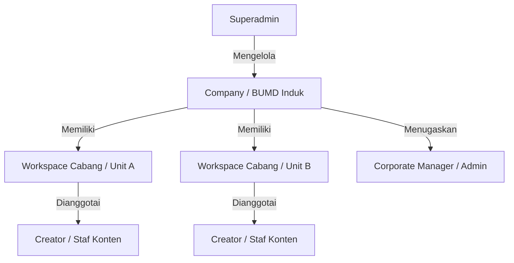
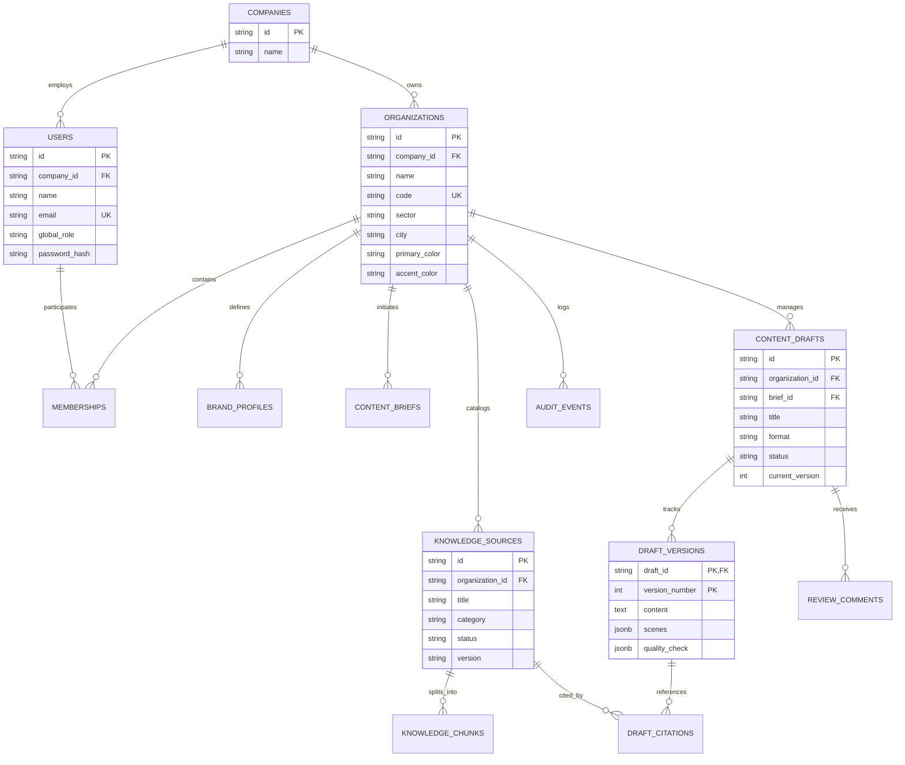
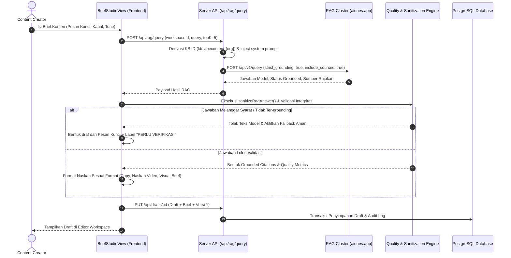

# VibeContent - System Architecture & Design Document

**Document Version:** 1.0  
**Project:** VibeContent (Workspace AI Pembuatan Konten BUMD)  
**Target Audience:** Enterprise BUMD (Badan Usaha Milik Daerah), Tim Pengembang, dan Stakeholder Korporat  
**Status:** Living Design Specification  

---

## 1. Executive Summary & Design Philosophy

### 1.1 Purpose & Problem Statement
**VibeContent** adalah workspace terpadu berbasis AI generatif dan *Retrieval-Augmented Generation* (RAG) yang dirancang khusus untuk memenuhi standar ketat komunikasi publik, tata kelola, dan kepatuhan faktual Badan Usaha Milik Daerah (BUMD) di Indonesia.

Dalam lingkungan BUMD, materi promosi, siaran pers, dan konten media sosial sering kali bersumber dari tumpukan dokumen resmi yang terfragmentasi (SK Direksi, SOP Layanan, Regulasi Tarif, Laporan Tahunan, Panduan Identitas Merek). Penggunaan asisten AI publik umumnya menghadapi risiko tinggi halusinasi data, kebocoran data rahasia (*data leakage*), serta ketidaksesuaian gaya komunikasi resmi.

### 1.2 Core Design Tenets
1. **Strict Factual Grounding (Zero Hallucination Tolerance):** Fakta organisasi BUMD hanya boleh ditarik dari basis pengetahuan (*knowledge base*) yang telah divalidasi dan diaktifkan. Jika fakta tidak didukung oleh sumber resmi, sistem secara eksplisit menolak mengarang dan melabeli draft dengan tanda **"PERLU VERIFIKASI"**.
2. **Corporate Governance & Approval Gateways:** Konten tidak dapat dipublikasikan atau dialihkan ke tahap visual lanjutan tanpa melalui verifikasi status, pemeriksaan kepatuhan (*Quality Check*), dan persetujuan pejabat/penanggung jawab berwenang.
3. **Rigid Multi-Tenant Isolation:** Arsitektur multi-tenant dengan isolasi data tingkat database dan per-workspace vector namespace. Dokumen satu BUMD tidak dapat diakses atau dibocorkan ke BUMD lain.
4. **Desktop-First Enterprise Ergonomics:** Antarmuka modern, responsif, dan elegan (*glassmorphism*, tipografi korporat *Plus Jakarta Sans*, tata letak kanban & kalender terstruktur) yang memfasilitasi alur kerja cepat bagi staf komunikasi dan reviewer.

---

## 2. High-Level Architecture

VibeContent dibangun dengan arsitektur decoupled yang memisahkan Frontend Client (Single-Page Application), Backend API Gateway & Business Orchestrator (Node.js/Express 5), Database Relasional (PostgreSQL), dan Eksternal RAG / Generative AI Engine.

### 2.1 Architecture Diagram

```mermaid
flowchart TB
    subgraph ClientLayer ["Client Presentation Layer (React 19 + TypeScript + Vite)"]
        UI_Shell["App Shell & Navigation Rail"]
        Views["Dashboard | Brief Studio | Editor Workspace | Visual Studio | Content Calendar | Brand Profile | Admin Panel"]
        ClientState["State Engine (Bootstrap Data, Reactive Hooks, Auth Session)"]
    end

    subgraph GatewayLayer ["Backend API & Orchestration (Express 5 + TypeScript)"]
        AuthMid["Security Middleware (Session Auth, CSRF Origin Guard, RBAC)"]
        TenantMid["Workspace Isolation Guard (requireWorkspace)"]
        APIRouters["Bootstrap API | Drafts API | Knowledge API | Visual API | Admin/Corporate API"]
        RAGProxy["RAG Orchestrator & Proxy Service (server/rag.ts)"]
        VisualEngine["Visual & Media Synthesizer (server/visual.ts)"]
    end

    subgraph DataLayer ["Persistence & External Services"]
        PG[(PostgreSQL Database\nOrganizations, Users, Briefs, Drafts, Chunks, Audit)]
        RAGService["External RAG Cluster (https://rag.aiones.app)\nIsolated Vector Namespaces per Workspace"]
        GenAIModels["Generative Media Models (Image & Video Synthesis)"]
    end

    UI_Shell --> Views
    Views --> ClientState
    ClientState <-->|HTTP / JSON (Credentials Included)| AuthMid
    AuthMid --> TenantMid
    TenantMid --> APIRouters
    APIRouters --> RAGProxy
    APIRouters --> VisualEngine
    APIRouters <-->|pg Pool Query / Transactions| PG
    RAGProxy <-->|Strict Grounded Query & Sync| RAGService
    VisualEngine <-->|Prompt Dispatch| GenAIModels
```

---

## 3. Multi-Tenancy & Access Control (RBAC)

VibeContent mengadopsi model hierarki korporat 3 lapis untuk mengakomodasi entitas induk (holding/pemerintah daerah), perusahaan BUMD, dan unit-unit kerja/cabang (workspaces).

### 3.1 Tenant Hierarchy



### 3.2 Role-Based Access Control Matrix

| Kemampuan / Fitur | Superadmin (`superadmin`) | Corporate Admin (`corporate`) | Content Creator (`creator`) |
|---|:---:|:---:|:---:|
| Manajemen Perusahaan & Tenant Global | ✅ Penuh | ❌ Dibatasi | ❌ Dilarang |
| Manajemen Seluruh Workspace Perusahaan | ✅ Penuh | ✅ Dalam perusahaannya | ❌ Dilarang |
| Manajemen Anggota & Akun Perusahaan | ✅ Penuh | ✅ Dalam perusahaannya | ❌ Dilarang |
| Konfigurasi Brand Profile & Pedoman Merek | ✅ Penuh | ✅ Dalam workspace terkait | ❌ Read-only |
| Manajemen Knowledge Base (Upload & Sinkronisasi) | ✅ Penuh | ✅ Dalam workspace terkait | ❌ Read-only |
| Pembuatan Brief & Trigger Generasi RAG | ✅ Penuh | ✅ Penuh | ✅ Penuh |
| Pengeditan Draft & Pembuatan Versi Baru | ✅ Penuh | ✅ Penuh | ✅ Penuh |
| Persetujuan Konten (*Approval Gate*) | ✅ Penuh | ✅ Penuh | ⚠️ *Self-Approve* terbatas |
| Akses Studio Visual & Export | ✅ Penuh | ✅ Penuh | ✅ Penuh |
| Penjadwalan Kalender Konten | ✅ Penuh | ✅ Penuh | ✅ Penuh |
| Audit Trail Global | ✅ Seluruh sistem | ✅ Lingkup Perusahaan | ❌ Lingkup Workspace |

### 3.3 Security & Authentication Mechanisms
- **Stateful Secure Session:** Sesi autentikasi disimpan di tabel `auth_sessions` menggunakan `token_hash` yang aman dengan masa kedaluwarsa eksplisit.
- **CSRF & Origin Enforcement:** Semua *mutating requests* (`POST`, `PUT`, `DELETE`) divalidasi terhadap `API_ALLOWED_ORIGIN` untuk mencegah eksploitasi lintas situs.
- **API Key Cloaking:** Kredensial dan API Key layanan pihak ketiga (`RAG_API_KEY`) hanya berada di server runtime; browser klien tidak memiliki akses terhadap token rahasia tersebut.

---

## 4. Data Architecture & Database Schema

Penyimpanan data mengandalkan PostgreSQL dengan integritas relasional penuh (*Foreign Key constraints* dengan `ON DELETE CASCADE`) dan struktur audit terpasang.

### 4.1 Entity Relationship Diagram



### 4.2 Core Tables Overview

1. **`organizations` (Workspaces):** Unit kerja BUMD mandiri yang memiliki identitas visual unik (`primary_color`, `accent_color`), sektor industri, dan kode unik.
2. **`knowledge_sources` & `knowledge_chunks`:** Dokumen acuan resmi (SK Direksi, SOP, Tarif, Laporan Tahunan) beserta fragmen teks hasil ekstraksi untuk kebutuhan grounding.
3. **`brand_profiles`:** Pedoman komunikasi organisasi dalam format JSONB: terminologi resmi wajib, kata-kata terlarang (*banned words*), tone of voice standar, dan call-to-action (CTA) resmi.
4. **`content_briefs`:** Parameter permintaan konten dari kreator (kampanye, format, kanal, audiens, pesan kunci, batasan).
5. **`content_drafts` & `draft_versions`:** Struktur *version-controlled* untuk seluruh materi yang dihasilkan. Setiap revisi membuat snapshot lengkap teks, scene video, sitasi, dan hasil pengujian kualitas.
6. **`draft_citations`:** Jejak keterkaitan klaim teks terhadap dokumen sumber di database, mencatat skor relevansi dan petikan bukti faktual.
7. **`audit_events`:** Rekaman log mutlak untuk kepatuhan BUMD atas seluruh aksi mutasi konten, perubahan dokumen, dan keputusan approval.

---

## 5. RAG Pipeline & Grounding Engine

Alur RAG dirancang untuk mengeliminasi halusinasi model dengan memadukan *Strict Vector Retrieval*, *Context Injection*, *Response Sanitization*, dan *Heuristic Rule Validation*.

### 5.1 End-to-End Pipeline Workflow



### 5.2 Anti-Hallucination & Quality Verification Rules
Setiap output yang dihasilkan diverifikasi secara otomatis melalui `runQualityCheck`:
- **Factual Grounding Check:** Memverifikasi ketersediaan sitasi valid dari knowledge base aktif. Klaim tanpa sumber dikelompokkan ke dalam daftar `ungroundedClaims`.
- **Numerical & Statistic Integrity:** Mengecek kesesuaian angka dan metrik tarif agar tidak ada penambahan nominal yang tidak tercantum dalam dokumen acuan.
- **Banned Words & Slang Filter:** Memindai kata-kata tidak baku atau istilah terlarang berdasarkan `brand_profiles.bannedWords`.
- **CTA & Disclaimer Compliance:** Memastikan ajakan bertindak resmi (*official CTA*) dan *disclaimer* wajib BUMD tercantum secara utuh.
- **Language & Artifact Sanitizer:** Membersihkan token internal AI, kutipan sitasi berformat angka sintetis (misal `[1]`), dan mendeteksi aksara non-Latin.

---

## 6. UI/UX Design System & Layout Architecture

Antarmuka VibeContent mengedepankan identitas korporat modern Indonesia dengan kombinasi tema warna profesional, kontras tinggi, dan tata letak modular.

### 6.1 Design Tokens

```css
:root {
  /* Corporate Palette */
  --bg-primary: #f8fafc;
  --bg-secondary: #ffffff;
  --bg-tertiary: #f1f5f9;
  --bg-card: rgba(255, 255, 255, 0.85);
  --border-subtle: #e2e8f0;
  --border-focus: #0284c7;

  /* Brand Accents */
  --primary: #0284c7;           /* Sky Blue Enterprise */
  --primary-hover: #0369a1;
  --accent-cyan: #06b6d4;
  --accent-emerald: #10b981;     /* Verified / Approved */
  --accent-amber: #f59e0b;       /* Review Pending */
  --accent-rose: #f43f5e;        /* Revision / Ungrounded */

  /* Typography */
  --font-sans: 'Plus Jakarta Sans', system-ui, sans-serif;
  --font-mono: 'JetBrains Mono', monospace;
}
```

### 6.2 Structural Viewport Layout
Aplikasi menggunakan tata letak dua tingkat:
1. **Top Header (Tinggi 72px):** Sticky dengan efek *backdrop blur*, memuat identitas workspace BUMD aktif, *workspace switcher dropdown*, profil pengguna, dan *toggle sidebar rail*.
2. **Main Layout Body:**
   - **Collapsible Navigation Rail (Kiri):** Memiliki status persisten di `localStorage`. Menyediakan akses instan ke 9 modul kerja dengan ikon representatif.
   - **Dynamic Content Viewport (Kanan):** Area kerja adaptif yang memuat modul aktif.

### 6.3 Module & Screen Specifications

```
├── DashboardView               -> Analisis performa konten, metrik approval, shortcut aksi cepat
├── BriefStudioView             -> Studio pembuatan brief terstruktur & generator konten berbasis RAG
├── EditorWorkspaceView         -> Editor naskah multi-versi, panel sitasi rujukan, review & komentar
├── VisualStudioView            -> Generator aset visual SVG/Canvas, komposisi multi-rasio & video reels
├── ContentSchedulingView       -> Kalender editorial interaktif (Grid mingguan/bulanan, multi-platform)
├── LibraryView                 -> Pustaka draft tersimpan, filter status, filter format, ekspor dokumen
├── BrandProfileView            -> Pengaturan panduan merek, terminologi baku, kata terlarang, CTA resmi
├── AuditLogView                -> Jejak rekam aktivitas kepatuhan dan histori transaksi dokumen
├── CorporateManagementView     -> Konsol administrasi holding BUMD & workspace unit kerja
└── SuperadminView              -> Pengaturan global multi-tenant & manajemen kredensial korporat
```

---

## 7. Media & Visual Synthesis Architecture

Modul **Visual Studio** menyediakan kapabilitas transformasi naskah tekstual yang telah disetujui (*Approved Draft*) menjadi materi visual publik siap posting.

### 7.1 Visual Assets Generation Pipeline
- **Smart Aspect-Ratio Adaptation:**
  * **1:1 (Square):** Postingan feed Instagram, Facebook, dan LinkedIn.
  * **9:16 (Story / Reel):** Format vertikal untuk Instagram Story, Reels, dan TikTok.
  * **16:9 (Landscape):** Banner Twitter/X, YouTube Thumbnail, dan header website korporat.
- **Deterministic Canvas & SVG Renderer:** Merender visual dengan tipografi korporat yang tajam, logo BUMD, warna aksen organisasi, badge status, dan teks legal disclaimer secara konsisten tanpa ketergantungan pada model eksternal.
- **Short-form Video Reel Sequencer (`visualScene.ts`, `visualReel.ts`):** Mengonversi adegan naskah video (*scenes*) menjadi urutan visual beranimasi dengan timing pergantian teks di layar (*text-on-screen*) dan narasi audio.

---

## 8. Export & Interoperability Center

Draft yang telah disetujui dapat diekspor melalui `ExportModal` ke berbagai format korporat:
1. **PDF Formatted Document:** Dokumen siap cetak dengan header resmi BUMD, nomor disposisi, riwayat persetujuan, dan catatan rujukan dokumen sumber.
2. **Structured Markdown (.md):** Standar dokumentasi tim teknis dan arsip digital.
3. **HTML Email / Press Release:** Format siap pakai untuk komunikasi via newsletter email atau siaran pers media massa.
4. **Clean Plain Text (.txt):** Teks murni yang disanitasi untuk *copy-paste* langsung ke dashboard Meta Business Suite atau Twitter/X.

---

## 9. Error Handling, Resilience & Monitoring

| Skenario Kegagalan | Mekanisme Penanganan (Resilience Pattern) | Dampak bagi Pengguna |
|---|---|---|
| Layanan RAG Eksternal Offline / Timeout | Fallback otomatis ke *Rule-Based Generator* berbasis pesan kunci brief. Draft disimpan dengan penanda `perlu_verifikasi`. | Pengguna tetap dapat melanjutkan pekerjaan tanpa kehilangan draf. |
| Sinkronisasi Dokumen Gagal (`syncKnowledgeDocToRag`) | Server menyelesaikan mutasi database lokal dan mencatat status `ragSynced: false` pada payload respons. | Data lokal tetap aman; sinkronisasi dapat diulang melalui tombol *Sync KB*. |
| Akses Lintas Workspace Ilegal | Middleware `requireWorkspace` memotong request dengan HTTP 403 Forbidden dan mencatat audit event. | Isolasi tenant terjaga mutlak. |
| Inkonsistensi Sesi / Expired Token | Klien mendeteksi HTTP 401 dan secara otomatis mengarahkan ke halaman login `AuthView`. | Mencegah status menggantung di antarmuka. |

---

## 10. Future Roadmap & Extensibility (Post-MVP)

- **Phase 2 - Direct Social Media Publishing:** Integrasi OAuth2 langsung dengan Meta Graph API (Instagram/Facebook) dan LinkedIn API untuk penerbitan otomatis dari modul Content Calendar.
- **Phase 3 - Analytics & Performance Ingestion:** Pengambilan metrik keterlibatan publik (*impressions*, *reach*, *sentiment analysis*) untuk memberi umpan balik pada penyusunan brief berikutnya.
- **Phase 4 - Advanced OCR & Multi-Format Parsing:** Ekstraksi otomatis dokumen PDF berformat pindaian (*scanned PDF*) dan slide presentasi internal BUMD ke dalam format chunk yang diindeks secara berkala.
